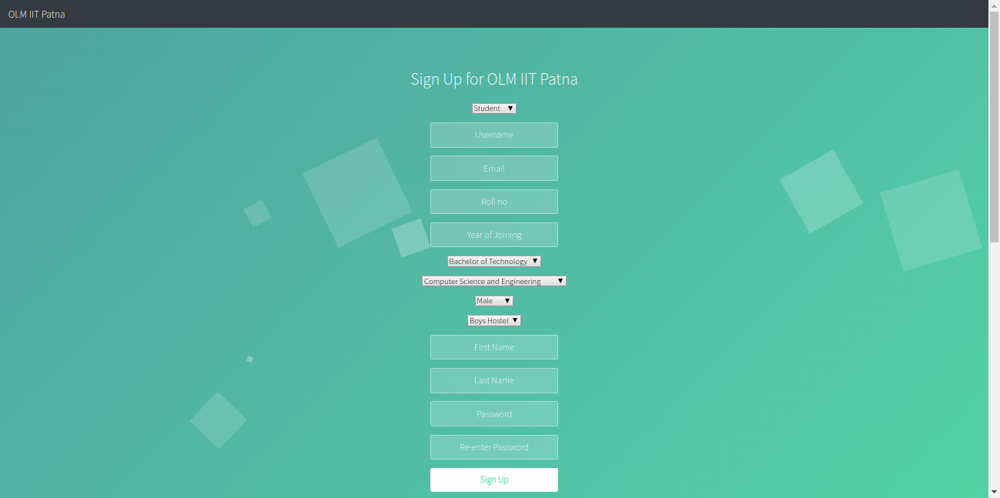
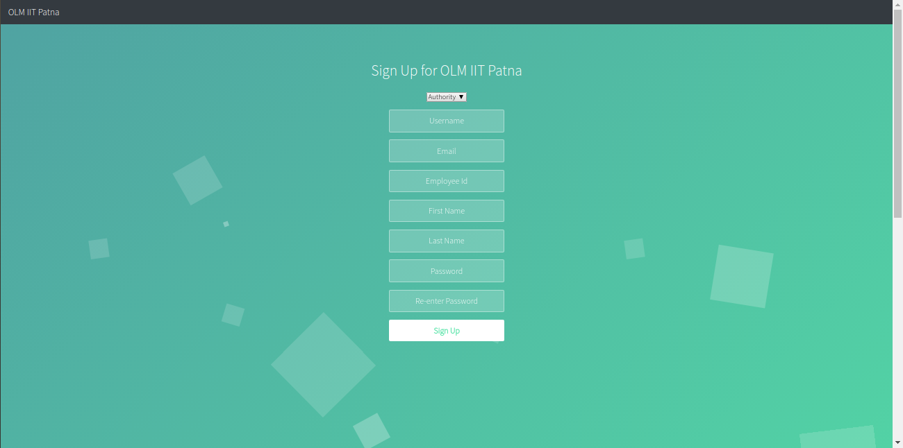
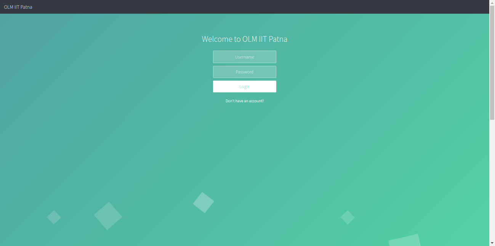
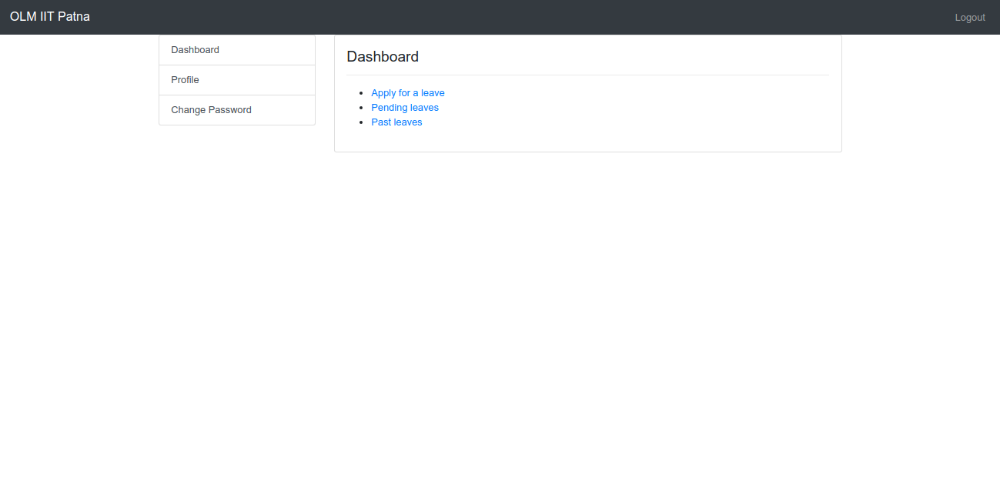
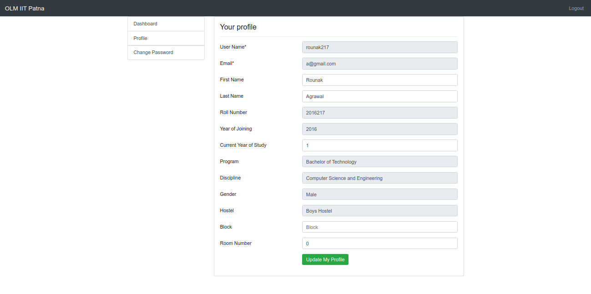
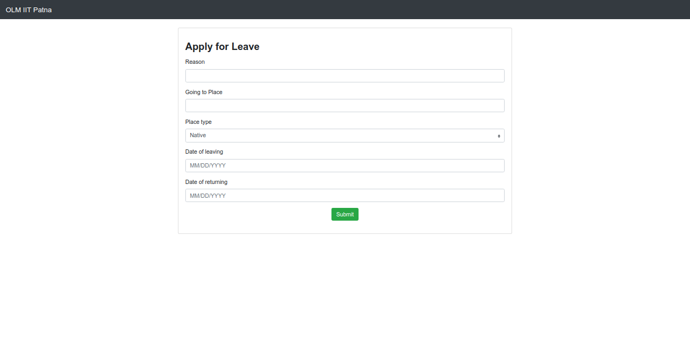

# Online Leave Management System - IIT Patna

An online leave management system for the students of IIT Patna. The students as well as the authorities can use this system to prevent the paper work that is needed whenever a student needs to get his/her leave approved.

Check out the project [here](https://olmiitp.herokuapp.com) and a project screencast [here](https://www.youtube.com/watch?v=FRANzCSUHJo).

### Features
- User accounts for students as well as authorities
- Students can apply for a leave as well as see pending (not approved yet) and past leaves (approved)
- Authorities can see all pending (not approved yet) and past leaves (approved)

### Technologies Used
- Python
- Django
- Bootstrap
- HTML
- CSS

### Screenshots

- Student Sign Up

- Authority Sign Up

- Login

- Dashboard

- Profile

- Apply For Leave

### How to set up the project on your system?

To set up the project on your system, follow the steps mentioned [here](https://github.com/arundhati24/online_leave_management_iitp/blob/development/docs/SET_UP_PROJECT.md).

### Contribution Guidelines

If you are looking forward to contribute to this project, please read the [contribution guidelines](https://github.com/arundhati24/online_leave_management_iitp/blob/development/docs/CONTRIBUTING.md) before starting.

### Project Created and Maintained By: 
Arundhati Gupta ([@arundhati24](https://github.com/arundhati24))